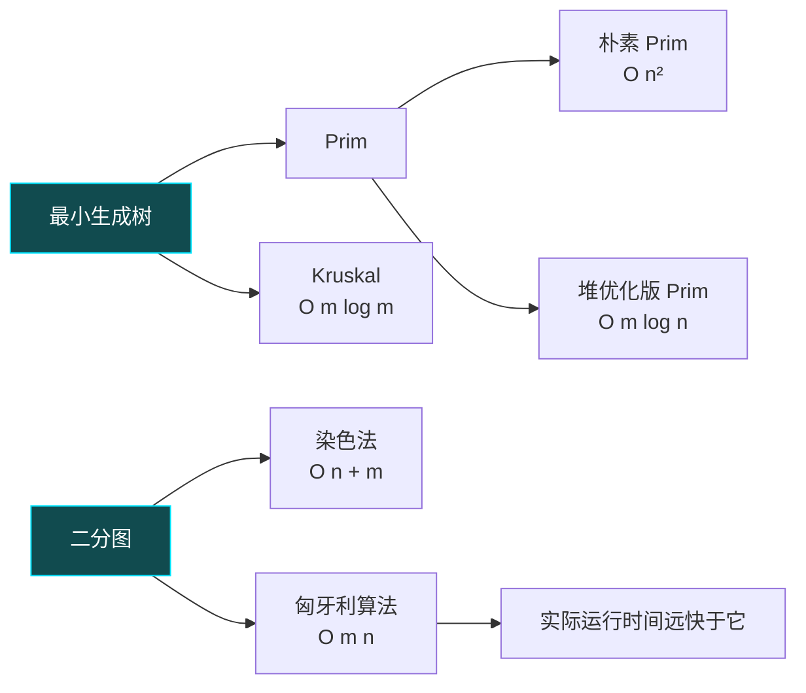

#图论 #算法

```mermaid
graph LR
    %% 核心节点
    MST[最小生成树]
    Bi[二分图]

    %% 最小生成树分支
    MST --> Prim[Prim]
    MST --> Kruskal[Kruskal <br>O m log m]
    
    Prim --> Prim_Naive[朴素 Prim <br>O n²]
    Prim --> Prim_Heap[堆优化版 Prim <br>O m log n]

    %% 二分图分支
    Bi --> Coloring[染色法 <br>O n + m]
    Bi --> Hungarian[匈牙利算法 <br>O m n]
    
    Hungarian --> Note[实际运行时间远快于它]

    %% 样式调整
    style MST fill:#114B4F,stroke:#00E5FF,color:#fff
    style Bi fill:#114B4F,stroke:#00E5FF,color:#fff
```

