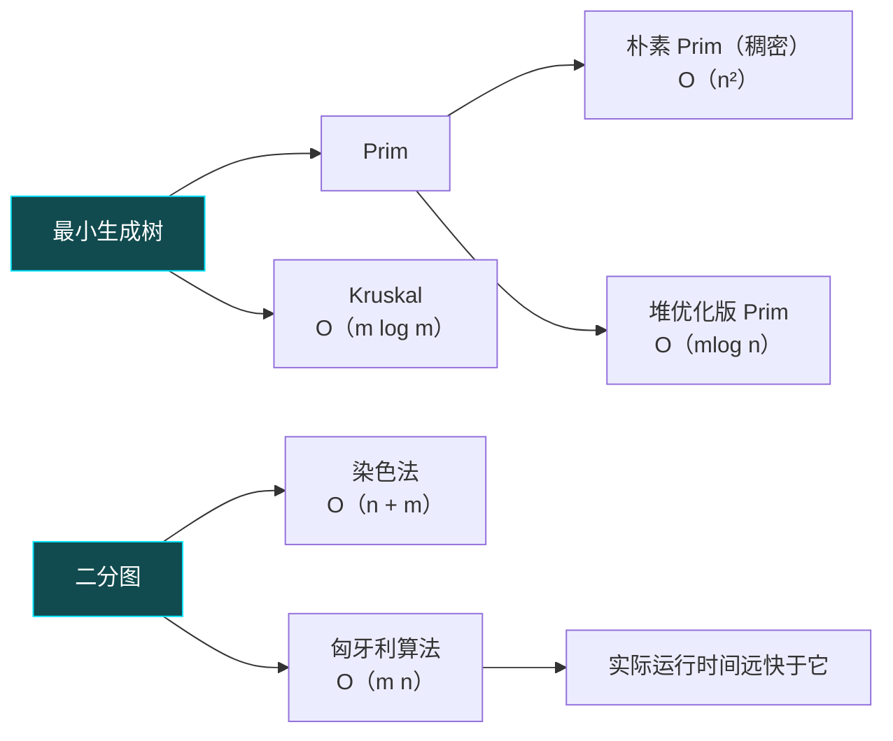

#图论 #算法




# 最小生成树

## 朴素prim


https://www.acwing.com/problem/content/860/

```cpp
#include <iostream> 
#include <cstring>
using namespace std;
const int N = 510, INF = 0x3f3f3f3f;
int dist[N], g[N][N];
bool st[N];
int n, m;
int prim()
{
    memset(dist, 0x3f, sizeof dist);
    int res = 0;
    for (int i = 0; i < n; i++)
    {
        int t = -1;
        for (int j = 1; j <= n; j++)
            if (!st[j] && (t == -1 || dist[t] > dist[j]))
                t = j;

        if (i && dist[t] == INF)//不是起始点且没有连接点
            return INF;
        if (i)
            res += dist[t];//更新res
        st[t] = true;//进树

        for (int j = 1; j <= n; j++)
            dist[j] = min(dist[j], g[t][j]);//更新最短路（初始dist在这一步更新，g[t][t]不用更新）
    }
    return res;
}

int main()
{
    cin >> n >> m;
    memset(g, 0x3f, sizeof g);
    while (m--)
    {
        int a, b, w;
        cin >> a >> b >> w;
        g[a][b] = g[b][a] = min(g[a][b], w);//无向图
    }
    int t = prim();
    if (t == INF)
        cout << "impossible" << endl;
    else
        cout << t << endl;
}
```


## kruskal

https://www.acwing.com/problem/content/861/


```cpp
#include <bits/stdc++.h>
using namespace std;
#define int long long
const int N = 2e5 + 10;
int n, m, INF = 0x3f3f3f3f, cnt, res;
int p[N];

struct Edge
{
    int a, b, w;
    bool operator<(const Edge &other) const//重载<		
    {
        return w < other.w;
    }
} edge[N];

int find(int a)//并查集应用
{
    if (p[a] != a)
        p[a] = find(p[a]);
    return p[a];
}

int kruskal()
{
    sort(edge, edge + m);//权重排序
    for (int i = 1; i <= n; i++)
        p[i] = i;

    for (int i = 0; i < m; i++)
    {
        int a = edge[i].a, b = edge[i].b, w = edge[i].w;
        a = find(a), b = find(b);
        if (a != b)//判断祖宗是否相等
        {
            p[a] = b;
            cnt++;
            res += w;
        }
    }
    if (cnt < n - 1)//如果步数<n-1说明提前结束不连通
        return INF;
    else
        return res;
}

signed main()
{
    ios::sync_with_stdio(false);
    cin.tie(nullptr);
    cin >> n >> m;
    for (int i = 0; i < m; i++)
    {
        int a, b, w;
        cin >> a >> b >> w;
        edge[i] = {a, b, w};
    }
    int t = kruskal();
    if (t == INF)
        cout << "impossible" << endl;
    else
        cout << t << endl;
}
```


# 二分图

