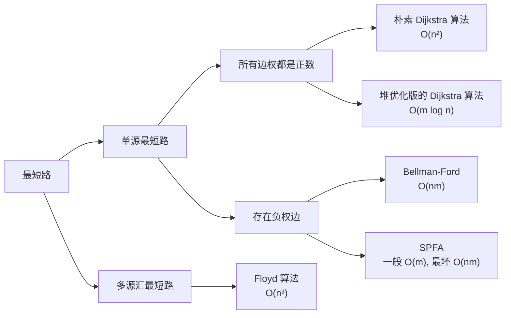

#图论 #最短路



# 单源最短路

## 正数边权

### 朴素Dijkstra（稠密）

https://www.acwing.com/problem/content/851/

```cpp
#include <bits/stdc++.h>
using namespace std;

const int N = 510;
int n, m;
int g[N][N];//存两点间长度
int dist[N];//存1到某点距离
bool st[N];//是否走过

int dijkstra()
{
    memset(dist, 0x3f, sizeof dist);//初始化距离
    dist[1] = 0;//标记初始点
    for (int i = 0; i < n; i++)
    {
        int t = -1;//保证t一定会变
        for (int j = 1; j <= n; j++)
            if (!st[j] && (t == -1 || dist[t] > dist[j]))
                t = j;//找出未标记的最近点

        st[t] = true;//标记走过

        for (int j = 1; j <= n; j++)
            dist[j] = min(dist[j], dist[t] + g[t][j]);//用t更新临近点的最短路
    }
    if (dist[n] == 0x3f3f3f3f)//走不通
        return -1;
    return dist[n];
}

signed main()
{
    cin >> n >> m;
    memset(g, 0x3f, sizeof g);//初始化两点距离数组
    while (m--)
    {
        int a, b, c;
        cin >> a >> b >> c;
        g[a][b] = min(g[a][b], c);//两点有多条赋权边，因此保留最短
    }
    int t = dijkstra();
    printf("%d", t);
}
```


### 堆优化版Dijkstra

https://www.acwing.com/problem/content/852/

```cpp
#include <bits/stdc++.h>
using namespace std;
typedef pair<int, int> PII;
const int N = 150010;
int n, m;
int e[N], w[N], h[N], ne[N], idx;
int dist[N];
bool st[N];

void add(int a, int b, int c)
{
    e[idx] = b;
    w[idx] = c;//赋权边
    ne[idx] = h[a];
    h[a] = idx++;
}//邻接表基操

int dijkstra()
{
    memset(dist, 0x3f, sizeof dist); // 初始化距离
    dist[1] = 0;                     // 标记初始点

    priority_queue<PII, vector<PII>, greater<PII>> heap; // 建堆
    heap.push({0, 1});

    while (heap.size())
    {
        auto t = heap.top();
        heap.pop();

        int ver = t.second, distance = t.first;
        if (st[ver])
            continue;//确定最短边直接过
        st[ver] = true;
        for (int i = h[ver]; i != -1; i = ne[i])
        {
            int j = e[i];
            if (dist[j] > distance + w[i])
            {
                dist[j] = distance + w[i];
                heap.push({dist[j], j});//入堆
            }
        }
    }

    if (dist[n] == 0x3f3f3f3f) // 走不通
        return -1;
    return dist[n];
}

signed main()
{
    cin >> n >> m;
    memset(h, -1, sizeof h);
    while (m--)
    {
        int a, b, c;
        cin >> a >> b >> c;
        add(a, b, c); // 建边
    }
    int t = dijkstra();
    printf("%d", t);
}
```


## 存在负权边

### bellman-ford

https://www.acwing.com/activity/content/problem/content/922/

```cpp
#include <bits/stdc++.h>
using namespace std;
#define int long long
const int N = 510, M = 10010;
int n, m, k;
int dist[N], backup[N];

struct edge
{
    int a, b, w;
} edge[M];

int bellman()
{
    memset(dist, 0x3f, sizeof dist);
    dist[1] = 0;
    for (int i = 0; i < k; i++)
    {
        memcpy(backup, dist, sizeof dist);
        for (int j = 0; j < m; j++)
        {
            int a = edge[j].a, b = edge[j].b, w = edge[j].w;
            dist[b] = min(dist[b], backup[a] + w);
        }
    }
    return dist[n];
}

signed main()
{
    ios::sync_with_stdio(false);
    cin.tie(nullptr);

    cin >> n >> m >> k;
    for (int i = 0; i < m; i++)
    {
        int a, b, w;
        cin >> a >> b >> w;
        edge[i] = {a, b, w};
    }
    int t = bellman();
    if (t > 0x3f3f3f3f / 2)
        puts("impossible");
    else
        cout << t << endl;
}
```


## sofa(bellman-ford优化)
