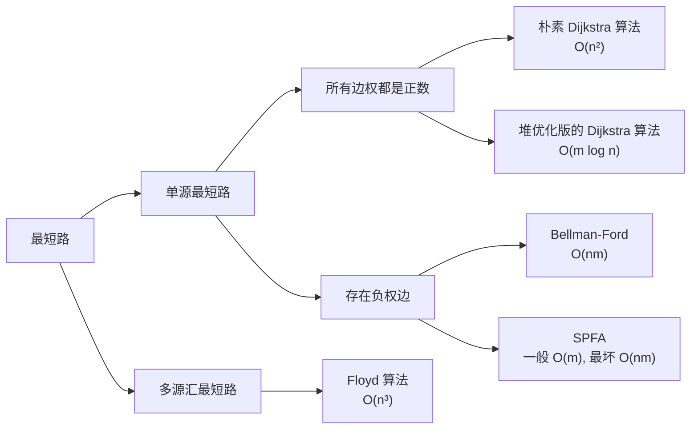

#图论 #最短路

```mermaid
graph LR
    A[最短路] --> B[单源最短路]
    A --> C[多源汇最短路]

    B --> D[所有边权都是正数]
    B --> E[存在负权边]

    D --> D1["朴素 Dijkstra 算法 <br/> O(n²)"]
    D --> D2["堆优化版的 Dijkstra 算法 <br/> O(m log n)"]

    E --> E1["Bellman-Ford <br/> O(nm)"]
    E --> E2["SPFA <br/> 一般 O(m), 最坏 O(nm)"]

    C --> C1["Floyd 算法 <br/> O(n³)"]
```

